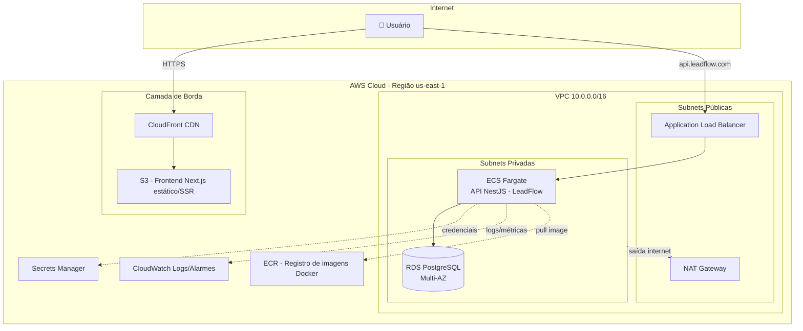

# ☁️ LeadFlow Cloud Architecture

> Projeto de estudo: arquitetura de deploy do **LeadFlow** (SaaS de automação comercial/SDR) na **AWS**, documentando decisões de arquitetura, infraestrutura como código e pipeline de CI/CD.

[](https://aws.amazon.com)
[](https://www.terraform.io)
[](https://nestjs.com)
[](https://nextjs.org)
[](./LICENSE)

---

## 🎯 Sobre este projeto

Este repositório documenta, passo a passo, como uma aplicação **full stack real** (o [LeadFlow](https://github.com/rosysilvaa), meu SaaS de automação comercial) pode ser levada da minha máquina local até uma infraestrutura de nuvem **escalável, segura e com custo controlado** na AWS.

O objetivo não é só "subir a aplicação" — é registrar o **raciocínio por trás de cada escolha de arquitetura**, para consolidar meu aprendizado em cloud e servir de referência/portfólio.

**Stack da aplicação:**
- Backend: NestJS + Prisma + PostgreSQL + JWT
- Frontend: Next.js + TypeScript
- Infraestrutura: AWS (ECS Fargate, RDS, S3, CloudFront, ALB, VPC)
- IaC: Terraform
- CI/CD: GitHub Actions

---

## 🗺️ Arquitetura (visão geral)



📌 Diagrama completo e detalhado (com IAM, security groups e fluxo de CI/CD) em [`docs/02-arquitetura.md`](docs/02-arquitetura.md).

---

## 📚 Documentação

| Documento | Conteúdo |
|---|---|
| [01 - Visão Geral](docs/01-visao-geral.md) | Contexto do projeto, objetivos e requisitos |
| [02 - Arquitetura](docs/02-arquitetura.md) | Diagramas detalhados, componentes e fluxo de dados |
| [03 - Serviços AWS](docs/03-servicos-aws.md) | Cada serviço usado, por que foi escolhido e alternativas |
| [04 - Guia de Deploy](docs/04-guia-deploy.md) | Passo a passo prático para reproduzir o deploy |
| [05 - Segurança](docs/05-seguranca.md) | IAM, security groups, secrets, criptografia |
| [06 - Custos](docs/06-custos.md) | Estimativa de custo mensal por serviço |

---

## 🧱 Estrutura do repositório

```
leadflow-cloud-architecture/
├── docs/                      # Documentação detalhada (o coração do projeto)
├── infra/terraform/           # Infraestrutura como código (Terraform)
├── docker/                    # Dockerfiles do backend e frontend
├── .github/workflows/         # Pipeline de CI/CD (GitHub Actions)
├── .env.example
└── README.md
```

---

## 🚀 Como usar este projeto

Este repositório é **educacional** — ele mostra a arquitetura e o código de infraestrutura, mas não conecta a uma conta AWS automaticamente. Para reproduzir:

1. Leia [`docs/01-visao-geral.md`](docs/01-visao-geral.md) para entender o contexto
2. Configure suas credenciais AWS (`aws configure`)
3. Siga o [`docs/04-guia-deploy.md`](docs/04-guia-deploy.md) passo a passo
4. Ajuste variáveis em `infra/terraform/variables.tf` para seu ambiente

```bash
cd infra/terraform
terraform init
terraform plan
terraform apply
```

---

## 🧠 Principais aprendizados registrados

- Diferença entre **subnets públicas e privadas** e por que o banco de dados nunca deve ficar exposto à internet
- Como o **ECS Fargate** elimina a necessidade de gerenciar servidores (serverless containers)
- Uso do **Secrets Manager** para nunca versionar credenciais no código
- Como o **CloudFront + S3** reduz latência entregando o frontend via CDN
- Estruturação de um pipeline de **CI/CD** que builda, testa e faz deploy automaticamente

---

## 👩‍💻 Autora

**Roseane da Silva** — Desenvolvedora Full Stack, mentora e palestrante em IA
🔗 [@rose.mentoring](https://instagram.com/rose.mentoring) · [GitHub](https://github.com/rosysilvaa)

---

## 📄 Licença

Este projeto está sob a licença MIT — veja [LICENSE](LICENSE) para detalhes.
