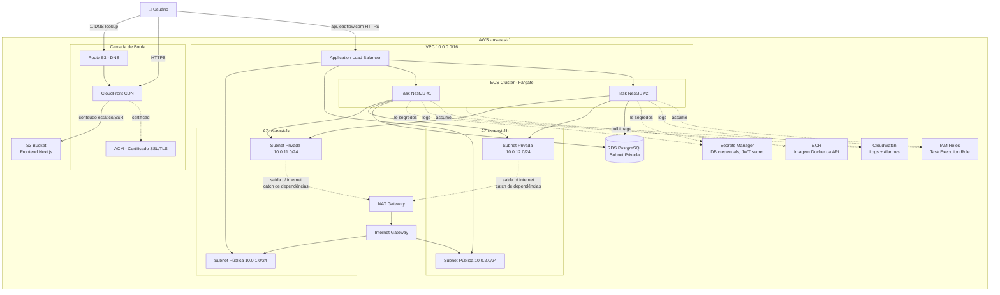
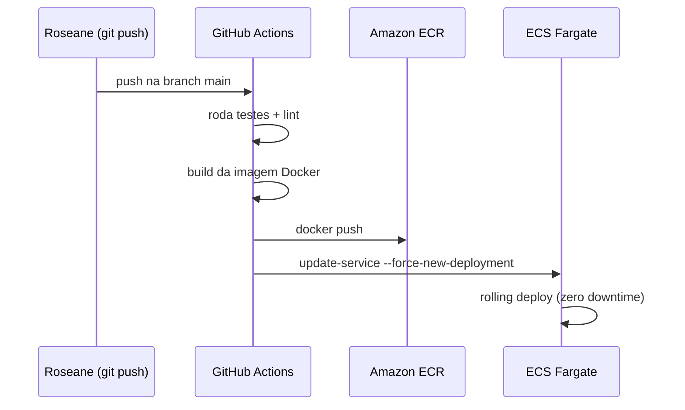

# 02 · Arquitetura Detalhada

## Diagrama completo

## Componentes e responsabilidades

### 1. Frontend (S3 + CloudFront)
O Next.js é buildado como estático (`next export`) ou SSR leve e servido via **S3 + CloudFront**. O CloudFront funciona como CDN, cacheando conteúdo nas edge locations mais próximas do usuário e reduzindo latência.

### 2. Backend (ECS Fargate)
A API NestJS roda em containers gerenciados pelo **ECS Fargate** — não precisamos provisionar ou gerenciar servidores EC2. O Fargate cobra pelo consumo real de CPU/memória das tasks.

- Mínimo de 2 tasks (uma por Availability Zone) para alta disponibilidade
- Auto scaling configurado por uso de CPU (>70% → escala horizontalmente)

### 3. Load Balancer (ALB)
O **Application Load Balancer** distribui requisições entre as tasks do ECS, faz health checks (`/health`) e é o único ponto de entrada HTTPS para a API.

### 4. Banco de dados (RDS PostgreSQL)
Fica em **subnet privada**, sem IP público. Só aceita conexões vindas do Security Group das tasks ECS. Backups automáticos diários, snapshot antes de qualquer alteração estrutural.

### 5. Rede (VPC)
- **Subnets públicas**: ALB e NAT Gateway
- **Subnets privadas**: ECS Tasks e RDS — nunca acessíveis diretamente da internet
- **NAT Gateway**: permite que as tasks privadas façam requisições de saída (ex: chamar APIs externas) sem expor portas de entrada

### 6. Secrets Manager
Credenciais do banco, JWT secret e outras chaves sensíveis **nunca ficam no código ou em variáveis de ambiente do Dockerfile** — são injetadas em runtime pelo ECS a partir do Secrets Manager.

### 7. Observabilidade (CloudWatch)
Logs de aplicação, métricas de CPU/memória das tasks e alarmes (ex: taxa de erro 5xx > 5%) centralizados no CloudWatch.

## Fluxo de uma requisição

1. Usuário acessa `app.leadflow.com` → Route 53 resolve → CloudFront entrega o frontend (cache ou origin S3)
2. Frontend faz chamada `fetch()` para `api.leadflow.com`
3. Requisição chega ao ALB via HTTPS (certificado do ACM)
4. ALB roteia para uma task saudável do ECS
5. Task NestJS processa, consulta/grava no RDS PostgreSQL
6. Resposta retorna pelo mesmo caminho

## Fluxo de deploy (CI/CD)

➡️ Próximo: [03 - Serviços AWS](03-servicos-aws.md)
